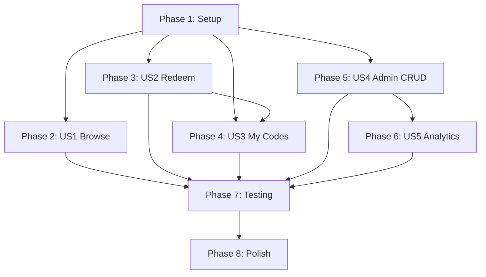

# Implementation Tasks: Point-Based Discount Redemption System

**Feature**: 007-discount-redemption  
**Branch**: `007-discount-redemption`  
**Created**: December 5, 2025  
**Estimated Total**: 18-22 hours

---

## Task Organization

Tasks are organized by user story to enable independent implementation and testing. Each phase represents a complete, deployable increment following Clean Architecture layers (Domain → Application → Infrastructure → Presentation).

**Priority Mapping**:
- User Story 1 (P1): Browse Available Discounts
- User Story 2 (P1): Redeem Points for Discount Code  
- User Story 3 (P2): View My Redeemed Discount Codes
- User Story 4 (P2): Admin Creates and Manages Discount Types
- User Story 5 (P3): Admin Views Redemption Analytics

---

## Phase 1: Setup & Infrastructure (2 hours)

**Goal**: Initialize project structure and shared infrastructure required by all user stories.

**Tasks**:

- [x] T001 Create database migration script AddDiscountSystem in backend/src/WahadiniCryptoQuest.DAL/Migrations/
- [x] T002 [P] Add DiscountType entity to backend/src/WahadiniCryptoQuest.Core/Entities/DiscountType.cs
- [x] T003 [P] Add UserDiscountRedemption entity to backend/src/WahadiniCryptoQuest.Core/Entities/UserDiscountRedemption.cs
- [x] T004 [P] Add RowVersion property to User entity in backend/src/WahadiniCryptoQuest.Core/Entities/User.cs for optimistic concurrency
- [x] T005 [P] Create DiscountTypeConfiguration in backend/src/WahadiniCryptoQuest.DAL/Configurations/DiscountTypeConfiguration.cs
- [x] T006 [P] Create UserDiscountRedemptionConfiguration in backend/src/WahadiniCryptoQuest.DAL/Configurations/UserDiscountRedemptionConfiguration.cs
- [x] T007 Add DbSet<DiscountType> and DbSet<UserDiscountRedemption> to ApplicationDbContext in backend/src/WahadiniCryptoQuest.DAL/Context/ApplicationDbContext.cs
- [x] T008 Run migration command: dotnet ef migrations add AddDiscountSystem from backend/src/WahadiniCryptoQuest.DAL
- [x] T009 Create seed data script backend/seed_discount_data.sql with sample discounts (SAVE10, SAVE20, SAVE50)
- [x] T010 [P] Create IDiscountRepository interface in backend/src/WahadiniCryptoQuest.Core/Interfaces/Repositories/IDiscountRepository.cs
- [x] T011 [P] Create IDiscountService interface in backend/src/WahadiniCryptoQuest.Core/Interfaces/Services/IDiscountService.cs
- [x] T012 [P] Create discount.types.ts in frontend/src/types/discount.types.ts with TypeScript interfaces
- [x] T013 [P] Create discountService.ts API client in frontend/src/services/api/discount.service.ts

**Deliverables**:
- Database schema with DiscountType and UserDiscountRedemption tables
- Domain entities with business logic (IsAvailable, GenerateCode, IncrementRedemptions)
- EF Core configurations with indexes and constraints
- Repository and service interfaces
- Frontend type definitions

---

## Phase 2: User Story 1 - Browse Available Discounts (P1) (3 hours)

**Story Goal**: Users can view all discounts they're eligible to redeem with their current points.

**Independent Test**: Navigate to /discounts page, verify all active non-expired discounts displayed with point costs and availability status based on user's current balance.

### Backend Tasks

- [x] T014 [P] [US1] Implement GetAvailableDiscountsQuery in backend/src/WahadiniCryptoQuest.Service/Discount/Queries/GetAvailableDiscountsQuery.cs
- [x] T015 [P] [US1] Implement GetAvailableDiscountsQueryHandler with CQRS in backend/src/WahadiniCryptoQuest.Service/Discount/Queries/GetAvailableDiscountsQueryHandler.cs
- [x] T016 [P] [US1] Create DiscountTypeDto in backend/src/WahadiniCryptoQuest.Core/DTOs/Discount/DiscountTypeDto.cs
- [x] T017 [US1] Implement DiscountRepository.GetAvailableDiscountsAsync in backend/src/WahadiniCryptoQuest.DAL/Repositories/DiscountRepository.cs
- [x] T018 [US1] Create GET /api/discounts/available endpoint in backend/src/WahadiniCryptoQuest.API/Controllers/DiscountController.cs with [Authorize] attribute
- [x] T019 [P] [US1] Add DiscountMappingProfile for AutoMapper in backend/src/WahadiniCryptoQuest.Service/Mappings/DiscountMappingProfile.cs
- [x] T020 [P] [US1] Create GetAvailableDiscountsRequestValidator in backend/src/WahadiniCryptoQuest.API/Validators/Discount/GetAvailableDiscountsRequestValidator.cs

### Frontend Tasks

- [x] T021 [P] [US1] Create useDiscounts hook in frontend/src/hooks/discount/useDiscounts.ts using React Query
- [x] T022 [P] [US1] Create DiscountCard component in frontend/src/components/discount/DiscountCard/DiscountCard.tsx
- [x] T023 [P] [US1] Create DiscountList component in frontend/src/components/discount/DiscountList/DiscountList.tsx
- [x] T024 [US1] Create AvailableDiscountsPage in frontend/src/pages/discount/AvailableDiscountsPage.tsx
- [x] T025 [P] [US1] Add discount routes to frontend/src/routes/index.tsx

**Deliverables**:
- Backend API endpoint returning filtered discounts based on availability and user eligibility
- Frontend discount gallery with responsive card layout
- Point balance display with affordability indicators

---

## Phase 3: User Story 2 - Redeem Points for Discount Code (P1) (5 hours)

**Story Goal**: Users can redeem points for discount codes with atomic transaction and concurrency control.

**Independent Test**: Select a discount, confirm redemption modal, verify points deducted, code issued, audit trail created, and all within single atomic transaction. Test concurrent redemptions don't cause double-spending.

### Backend Tasks

- [x] T026 [P] [US2] Create RedeemDiscountCommand in backend/src/WahadiniCryptoQuest.Service/Discount/Commands/RedeemDiscountCommand.cs
- [x] T027 [US2] Implement RedeemDiscountCommandHandler with transaction logic in backend/src/WahadiniCryptoQuest.Service/Discount/Commands/RedeemDiscountCommandHandler.cs
- [x] T028 [P] [US2] Create RedemptionResponseDto in backend/src/WahadiniCryptoQuest.Core/DTOs/Discount/RedemptionResponseDto.cs
- [x] T029 [US2] Implement DiscountService.RedeemDiscountAsync with atomic transaction in backend/src/WahadiniCryptoQuest.Service/Services/DiscountService.cs
- [x] T030 [US2] Add RewardService.DeductPointsForRedemption method in backend/src/WahadiniCryptoQuest.Service/Services/RewardService.cs
- [x] T031 [US2] Create POST /api/discounts/{id}/redeem endpoint in backend/src/WahadiniCryptoQuest.API/Controllers/DiscountController.cs
- [x] T032 [P] [US2] Create RedeemDiscountRequestValidator with FluentValidation in backend/src/WahadiniCryptoQuest.API/Validators/Discount/RedeemDiscountRequestValidator.cs
- [x] T033 [P] [US2] Add business logic methods to DiscountType entity: IsAvailable(), GenerateCode(Guid), IncrementRedemptions()
- [x] T034 [P] [US2] Add business logic methods to User entity: DeductPoints(int), HasSufficientPoints(int)
- [x] T035 [US2] Implement DiscountRepository.GetByIdWithRedemptionsAsync with eager loading in backend/src/WahadiniCryptoQuest.DAL/Repositories/DiscountRepository.cs
- [x] T036 [US2] Implement DiscountRepository.HasUserRedeemedAsync check in backend/src/WahadiniCryptoQuest.DAL/Repositories/DiscountRepository.cs
- [x] T037 [US2] Add error handling for DbUpdateConcurrencyException with 409 response in backend/src/WahadiniCryptoQuest.API/Middleware/ErrorHandlingMiddleware.cs

### Frontend Tasks

- [x] T038 [P] [US2] Create useRedeemDiscount mutation hook in frontend/src/hooks/discount/useRedeemDiscount.ts
- [x] T039 [P] [US2] Create RedemptionModal component in frontend/src/components/discount/RedemptionModal/RedemptionModal.tsx
- [x] T040 [P] [US2] Add discount redemption service method in frontend/src/services/api/discount.service.ts
- [x] T041 [US2] Integrate RedemptionModal with DiscountCard component for redeem button
- [x] T042 [US2] Update reward store to invalidate points balance query after redemption in frontend/src/store/reward.store.ts
- [x] T043 [P] [US2] Add toast notifications for success/error states in RedemptionModal
- [x] T044 [P] [US2] Implement copy-to-clipboard functionality for issued code in RedemptionModal

**Deliverables**:
- Complete redemption flow with atomic transaction (points deduction + code issuance + audit trail)
- Optimistic concurrency control preventing double-spending
- User-friendly redemption modal with confirmation and success states
- Real-time point balance updates

---

## Phase 4: User Story 3 - View My Redeemed Discount Codes (P2) (2.5 hours)

**Story Goal**: Users can access their redemption history and copy codes for checkout.

**Independent Test**: Redeem 2-3 discounts, navigate to My Discounts page, verify all codes displayed with expiry dates and copy functionality works.

### Backend Tasks

- [x] T045 [P] [US3] Create GetMyRedemptionsQuery in backend/src/WahadiniCryptoQuest.Service/Discount/Queries/GetMyRedemptionsQuery.cs
- [x] T046 [P] [US3] Implement GetMyRedemptionsQueryHandler with pagination in backend/src/WahadiniCryptoQuest.Service/Discount/Queries/GetMyRedemptionsQueryHandler.cs
- [x] T047 [P] [US3] Create UserRedemptionDto in backend/src/WahadiniCryptoQuest.Core/DTOs/Discount/UserRedemptionDto.cs
- [x] T048 [P] [US3] Create PaginationMetadata DTO in backend/src/WahadiniCryptoQuest.Core/DTOs/Common/PaginationMetadata.cs
- [x] T049 [US3] Implement DiscountRepository.GetUserRedemptionsAsync with pagination in backend/src/WahadiniCryptoQuest.DAL/Repositories/DiscountRepository.cs
- [x] T050 [US3] Create GET /api/discounts/my-redemptions endpoint in backend/src/WahadiniCryptoQuest.API/Controllers/DiscountController.cs

### Frontend Tasks

- [x] T051 [P] [US3] Create useMyRedemptions hook in frontend/src/hooks/discount/useMyRedemptions.ts with pagination
- [x] T052 [P] [US3] Create RedemptionCodeCard component in frontend/src/components/discount/RedemptionCodeCard/RedemptionCodeCard.tsx
- [x] T053 [P] [US3] Create MyDiscountsPage in frontend/src/pages/discount/MyDiscountsPage.tsx
- [x] T054 [P] [US3] Add pagination component to MyDiscountsPage
- [x] T055 [P] [US3] Implement zero-state UI for users with no redemptions in MyDiscountsPage
- [x] T056 [P] [US3] Add visual distinction for expired vs active codes in RedemptionCodeCard

**Deliverables**:
- Paginated redemption history API endpoint
- My Discounts page with code cards showing expiry status
- Copy-to-clipboard functionality with success feedback
- Empty state with link to browse discounts

---

## Phase 5: User Story 4 - Admin Creates and Manages Discount Types (P2) (3.5 hours)

**Story Goal**: Admins can create, update, and manage discount campaigns.

**Independent Test**: Login as admin, create new discount type with all parameters, verify it appears in user gallery, update expiry date, verify it disappears after expiry.

### Backend Tasks

- [x] T057 [P] [US4] Create CreateDiscountTypeCommand in backend/src/WahadiniCryptoQuest.Service/Discount/Commands/CreateDiscountTypeCommand.cs
- [x] T058 [P] [US4] Implement CreateDiscountTypeCommandHandler in backend/src/WahadiniCryptoQuest.Service/Discount/Commands/CreateDiscountTypeCommandHandler.cs
- [x] T059 [P] [US4] Create UpdateDiscountTypeCommand in backend/src/WahadiniCryptoQuest.Service/Discount/Commands/UpdateDiscountTypeCommand.cs
- [x] T060 [P] [US4] Implement UpdateDiscountTypeCommandHandler in backend/src/WahadiniCryptoQuest.Service/Discount/Commands/UpdateDiscountTypeCommandHandler.cs
- [x] T061 [P] [US4] Create ActivateDiscountCommand in backend/src/WahadiniCryptoQuest.Service/Discount/Commands/ActivateDiscountCommand.cs
- [x] T062 [P] [US4] Create DeactivateDiscountCommand in backend/src/WahadiniCryptoQuest.Service/Discount/Commands/DeactivateDiscountCommand.cs
- [x] T063 [P] [US4] Create AdminDiscountTypeDto in backend/src/WahadiniCryptoQuest.Core/DTOs/Discount/AdminDiscountTypeDto.cs
- [x] T064 [US4] Create POST /api/admin/discounts endpoint in backend/src/WahadiniCryptoQuest.API/Controllers/AdminDiscountController.cs with [Authorize(Policy = "RequireAdmin")]
- [x] T065 [US4] Create PUT /api/admin/discounts/{id} endpoint in backend/src/WahadiniCryptoQuest.API/Controllers/AdminDiscountController.cs
- [x] T066 [US4] Create DELETE /api/admin/discounts/{id} endpoint with soft delete in backend/src/WahadiniCryptoQuest.API/Controllers/AdminDiscountController.cs
- [x] T067 [US4] Create POST /api/admin/discounts/{id}/activate endpoint in backend/src/WahadiniCryptoQuest.API/Controllers/AdminDiscountController.cs
- [x] T068 [US4] Create POST /api/admin/discounts/{id}/deactivate endpoint in backend/src/WahadiniCryptoQuest.API/Controllers/AdminDiscountController.cs
- [x] T069 [P] [US4] Create CreateDiscountTypeRequestValidator in backend/src/WahadiniCryptoQuest.API/Validators/Discount/CreateDiscountTypeRequestValidator.cs
- [x] T070 [P] [US4] Create UpdateDiscountTypeRequestValidator in backend/src/WahadiniCryptoQuest.API/Validators/Discount/UpdateDiscountTypeRequestValidator.cs
- [x] T071 [US4] Add Stripe code validation logic in CreateDiscountTypeCommandHandler with 10-second timeout
- [x] T072 [P] [US4] Implement soft delete logic in DiscountType entity (IsDeleted flag)

### Frontend Tasks

- [x] T073 [P] [US4] Create useAdminDiscounts hook in frontend/src/hooks/admin/useAdminDiscounts.ts
- [x] T074 [P] [US4] Create useCreateDiscount mutation hook in frontend/src/hooks/admin/useCreateDiscount.ts
- [x] T075 [P] [US4] Create useUpdateDiscount mutation hook in frontend/src/hooks/admin/useUpdateDiscount.ts
- [x] T076 [P] [US4] Create DiscountForm component in frontend/src/components/admin/DiscountForm/DiscountForm.tsx with React Hook Form
- [x] T077 [P] [US4] Create DiscountManagementTable component in frontend/src/components/admin/DiscountManagementTable/DiscountManagementTable.tsx
- [x] T078 [US4] Create AdminDiscountsPage in frontend/src/pages/admin/AdminDiscountsPage.tsx
- [x] T079 [P] [US4] Add Zod validation schema for discount form in frontend/src/services/validation/discount.validation.ts
- [x] T080 [P] [US4] Add admin discount routes with ProtectedRoute(RequireAdmin) in frontend/src/routes/admin.routes.tsx

**Deliverables**:
- Complete admin CRUD interface for discount management
- Form validation for all discount parameters (point cost, percentage, dates)
- Stripe code validation with graceful timeout handling
- Activate/deactivate functionality
- Soft delete preserving historical redemptions

---

## Phase 6: User Story 5 - Admin Views Redemption Analytics (P3) (2 hours)

**Story Goal**: Admins can view redemption statistics to measure campaign effectiveness.

**Independent Test**: Create multiple discount types, simulate several redemptions, view analytics dashboard, verify accurate counts and totals.

### Backend Tasks

- [x] T081 [P] [US5] Create GetDiscountAnalyticsQuery in backend/src/WahadiniCryptoQuest.Service/Discount/Queries/GetDiscountAnalyticsQuery.cs
- [x] T082 [P] [US5] Implement GetDiscountAnalyticsQueryHandler in backend/src/WahadiniCryptoQuest.Service/Discount/Queries/GetDiscountAnalyticsQueryHandler.cs
- [x] T083 [P] [US5] Create GetAnalyticsSummaryQuery in backend/src/WahadiniCryptoQuest.Service/Discount/Queries/GetAnalyticsSummaryQuery.cs
- [x] T084 [P] [US5] Create DiscountAnalyticsDto in backend/src/WahadiniCryptoQuest.Core/DTOs/Discount/DiscountAnalyticsDto.cs
- [x] T085 [P] [US5] Create AnalyticsSummaryDto in backend/src/WahadiniCryptoQuest.Core/DTOs/Discount/AnalyticsSummaryDto.cs
- [x] T086 [US5] Implement service analytics methods in backend/src/WahadiniCryptoQuest.Service/Services/DiscountService.cs
- [x] T087 [US5] Create GET /api/admin/discounts/{id}/analytics endpoint in backend/src/WahadiniCryptoQuest.API/Controllers/AdminDiscountController.cs
- [x] T088 [US5] Create GET /api/admin/discounts/analytics/summary endpoint in backend/src/WahadiniCryptoQuest.API/Controllers/AdminDiscountController.cs

### Frontend Tasks

- [x] T089 [P] [US5] Create useDiscountAnalytics hook in frontend/src/hooks/admin/useDiscountAnalytics.ts
- [x] T090 [P] [US5] Create AnalyticsCard component in frontend/src/components/admin/AnalyticsCard/AnalyticsCard.tsx
- [x] T091 [P] [US5] Create DiscountAnalyticsDashboard component in frontend/src/components/admin/DiscountAnalyticsDashboard/DiscountAnalyticsDashboard.tsx
- [x] T092 [US5] Create DiscountAnalyticsPage in frontend/src/pages/admin/DiscountAnalyticsPage.tsx
- [ ] T093 [P] [US5] Add charts/visualizations for redemption trends using recharts library

**Deliverables**:
- Analytics API endpoints with aggregate statistics
- Admin dashboard showing total redemptions and points burned per discount
- Summary view ranking discounts by performance
- Visual charts for redemption trends

---

## Phase 7: Testing & Quality Assurance (2 hours)

**Goal**: Validate all user stories work independently and integrated, test concurrency, performance, and security.

### Backend Tests

- [x] T094 [P] Write unit test for DiscountType.IsAvailable() business logic in backend/tests/WahadiniCryptoQuest.Core.Tests/Entities/DiscountTypeTests.cs
- [x] T095 [P] Write unit test for User.DeductPoints() with insufficient balance in backend/tests/WahadiniCryptoQuest.Core.Tests/Entities/UserTests.cs
- [x] T096 [P] Write unit test for RedeemDiscountCommandHandler success scenario in backend/tests/WahadiniCryptoQuest.Service.Tests/Commands/RedeemDiscountCommandHandlerTests.cs
- [x] T097 [P] Write unit test for RedeemDiscountCommandHandler insufficient points failure in backend/tests/WahadiniCryptoQuest.Service.Tests/Commands/RedeemDiscountCommandHandlerTests.cs
- [x] T098 [P] Write unit test for RedeemDiscountCommandHandler already redeemed failure in backend/tests/WahadiniCryptoQuest.Service.Tests/Commands/RedeemDiscountCommandHandlerTests.cs
- [x] T099 [P] Write integration test for POST /api/discounts/{id}/redeem endpoint in backend/tests/WahadiniCryptoQuest.API.Tests/Controllers/DiscountControllerTests.cs
- [x] T100 [P] Write concurrency test for simultaneous redemption attempts in backend/tests/WahadiniCryptoQuest.API.Tests/Concurrency/RedemptionConcurrencyTests.cs
- [x] T101 [P] Write integration test for admin CRUD operations in backend/tests/WahadiniCryptoQuest.API.Tests/Controllers/AdminDiscountControllerTests.cs

### Frontend Tests

- [x] T102 [P] Write component test for DiscountCard with different availability states in frontend/src/components/discount/DiscountCard/__tests__/DiscountCard.test.tsx
- [x] T103 [P] Write component test for RedemptionModal success flow in frontend/src/components/discount/RedemptionModal/__tests__/RedemptionModal.test.tsx
- [x] T104 [P] Write hook test for useRedeemDiscount mutation in frontend/src/hooks/discount/__tests__/useRedeemDiscount.test.tsx
- [x] T105 [P] Write E2E test for complete redemption flow in frontend/tests/e2e/discount/discount-redemption.spec.ts using Playwright

### Security & Performance Tests

- [x] T106 [P] Verify [Authorize] attributes on all user endpoints using authorization integration tests
- [x] T107 [P] Verify [Authorize(Policy = "RequireAdmin")] on all admin endpoints
- [x] T108 [P] Test rate limiting (10 requests/user/minute) in backend/tests/WahadiniCryptoQuest.API.Tests/RateLimiting/DiscountRedemptionRateLimitTests.cs
- [x] T109 [P] Run performance test for 50 concurrent redemptions in backend/tests/WahadiniCryptoQuest.Performance.Tests/RedemptionLoadTests.cs
- [x] T110 [P] Test gallery page load with 1000 discount types < 2 seconds in frontend/tests/e2e/performance/gallery-performance.spec.ts

**Deliverables**:
- Unit tests covering all business logic (>80% coverage)
- Integration tests for all API endpoints
- Concurrency tests validating no double-spending
- Component tests for all frontend components
- E2E test for complete user journey
- Security tests validating authorization
- Performance tests meeting NFR requirements

---

## Phase 8: Polish & Documentation (1.5 hours)

**Goal**: Final touches, accessibility, error handling improvements, and documentation.

### Polishing Tasks

- [x] T111 [P] Add loading skeleton UI for discount gallery in frontend/src/components/discount/DiscountList/DiscountList.tsx → frontend/src/components/discount/DiscountListSkeleton/
- [x] T112 [P] Add error boundary for discount pages in frontend/src/components/discount/DiscountErrorBoundary.tsx → frontend/src/components/discount/DiscountErrorBoundary/
- [x] T113 [P] Implement keyboard navigation (Tab, Enter, Escape) for RedemptionModal → Added useEffect focus management, Enter key handler, Escape handled by Dialog
- [x] T114 [P] Add ARIA labels and live regions for screen reader support in all discount components → Added aria-label, aria-live, role attributes to DiscountCard and RedemptionModal
- [x] T115 [P] Add focus indicators meeting WCAG 2.1 Level AA (4.5:1 contrast) for interactive elements → Created frontend/src/styles/accessibility.css with :focus-visible styles
- [x] T116 [P] Test mobile responsiveness down to 320px for all discount pages → Updated responsive grid (sm:grid-cols-2), created docs/mobile-responsiveness-testing.md
- [x] T117 [P] Add retry logic (3 attempts) for transient database failures in DiscountService → Added Polly 8.2.0 with exponential backoff retry policy
- [x] T118 [P] Add structured logging for all redemption operations in DiscountService → Enhanced with duration tracking, detailed error context, and LogDebug for debugging
- [x] T119 [P] Add API documentation comments (XML docs) for all discount endpoints → Added comprehensive XML docs to DiscountController with samples and response codes

### Documentation Tasks

- [ ] T120 [P] Update README.md with discount redemption feature overview
- [ ] T121 [P] Document discount redemption API in Swagger/OpenAPI with examples
- [ ] T122 [P] Create admin user guide for discount management in docs/admin-discount-management-guide.md
- [ ] T123 [P] Update database schema documentation with discount tables

**Deliverables**:
- Polished UX with loading states and error handling
- Full WCAG 2.1 Level AA accessibility compliance
- Comprehensive API documentation
- User and admin guides
- Production-ready error handling and logging

---

## Dependencies & Execution Order

### Story Dependencies

**Sequential Dependencies**:
1. Phase 1 (Setup) MUST complete before any user story
2. US2 (Redeem) MUST complete before US3 (My Codes) - requires redemption logic
3. US4 (Admin CRUD) MUST complete before US5 (Analytics) - requires discount data
4. All phases MUST complete before Testing
5. Testing MUST complete before Polish

**Independent Stories** (can be parallelized after Setup):
- US1 (Browse) - independent, can start immediately after Setup
- US2 (Redeem) - independent, can start immediately after Setup
- US4 (Admin CRUD) - independent, can start immediately after Setup

---

## Parallel Execution Opportunities

### Phase 1: Setup (10 parallel tasks)
- T002-T006, T010-T013 can run in parallel (different files, no dependencies)

### Phase 2: US1 (7 parallel tasks)
- T014-T016, T019-T020, T021-T023, T025 can run in parallel after T017-T018 complete

### Phase 3: US2 (8 parallel tasks)
- T026, T028, T032-T034, T038-T040, T043-T044 can run in parallel
- T027, T029-T031, T035-T037, T041-T042 are sequential (depend on service implementation)

### Phase 4: US3 (6 parallel tasks)
- T045-T048, T051-T056 can run in parallel after T049-T050 complete

### Phase 5: US4 (9 parallel tasks)
- T057-T063, T069-T070, T072-T080 can run in parallel
- T064-T068, T071, T078 are sequential (depend on commands)

### Phase 6: US5 (9 parallel tasks)
- T081-T085, T089-T093 can run in parallel after T086-T088 complete

### Phase 7: Testing (17 parallel tasks)
- T094-T110 can ALL run in parallel (independent test files)

### Phase 8: Polish (13 parallel tasks)
- T111-T123 can ALL run in parallel (documentation and polishing)

**Total Parallelizable Tasks**: 79 out of 123 tasks (64%)

---

## Implementation Strategy

### MVP Scope (Phase 1-3: US1 + US2)
**Duration**: 10 hours  
**Value**: Users can browse and redeem discounts

**Includes**:
- Setup & infrastructure (T001-T013)
- Browse discounts gallery (T014-T025)
- Redeem with atomic transactions (T026-T044)

**MVP Deliverables**:
- Functional discount browsing
- Complete redemption flow with concurrency control
- Point balance updates
- Basic error handling

### Iteration 2 (Phase 4: US3)
**Duration**: +2.5 hours  
**Value**: Users can access their redeemed codes

**Adds**:
- My Discounts page (T045-T056)
- Redemption history with pagination
- Copy-to-clipboard functionality

### Iteration 3 (Phase 5-6: US4 + US5)
**Duration**: +5.5 hours  
**Value**: Admin management and analytics

**Adds**:
- Admin CRUD interface (T057-T080)
- Redemption analytics (T081-T093)
- Campaign management capabilities

### Production Release (Phase 7-8: Testing + Polish)
**Duration**: +3.5 hours  
**Value**: Production-ready with full testing and accessibility

**Adds**:
- Comprehensive test coverage (T094-T110)
- Accessibility compliance (T111-T116)
- Documentation and polish (T117-T123)

---

## Task Metrics

- **Total Tasks**: 123
- **Setup Tasks**: 13 (11%)
- **User Story 1 (P1)**: 12 tasks (10%)
- **User Story 2 (P1)**: 19 tasks (15%)
- **User Story 3 (P2)**: 12 tasks (10%)
- **User Story 4 (P2)**: 24 tasks (20%)
- **User Story 5 (P3)**: 12 tasks (10%)
- **Testing**: 17 tasks (14%)
- **Polish**: 14 tasks (11%)
- **Parallelizable Tasks**: 79 (64%)
- **Sequential Tasks**: 44 (36%)

**Estimated Total Time**: 18-22 hours (varies by team size and parallelization)

---

## Format Validation ✅

All 123 tasks follow the required checklist format:
- ✅ All tasks have checkbox `- [ ]`
- ✅ All tasks have sequential Task ID (T001-T123)
- ✅ Parallelizable tasks marked with [P] (79 tasks)
- ✅ User story tasks marked with [US1]-[US5] (79 tasks)
- ✅ All tasks include specific file paths
- ✅ Descriptions are clear and actionable

**Status**: Ready for implementation
